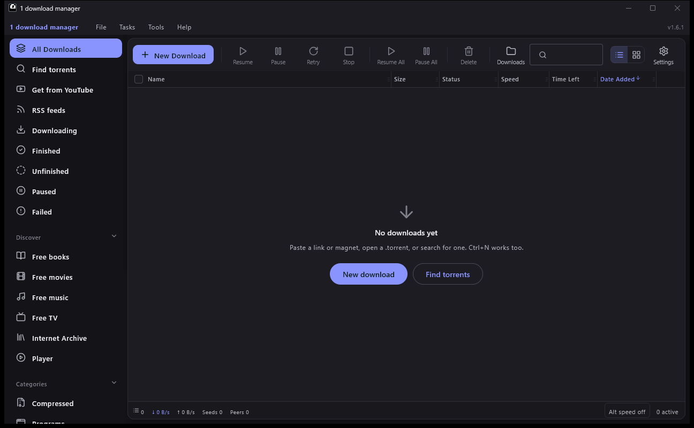
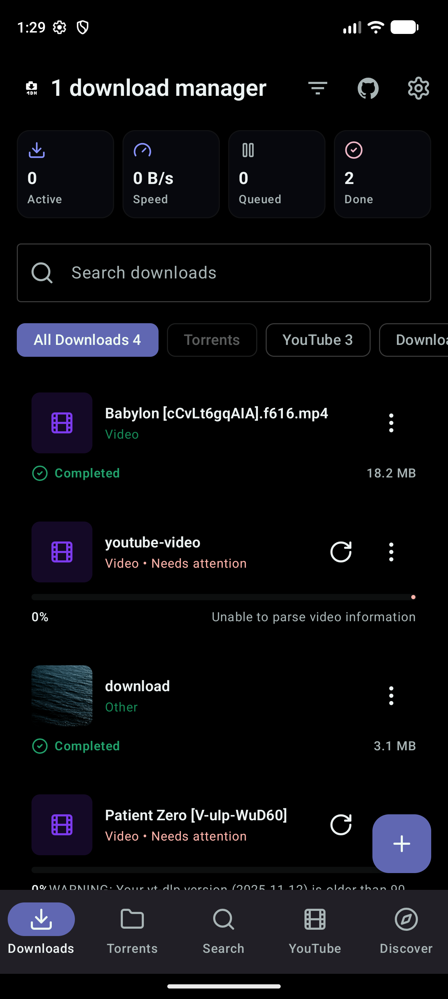
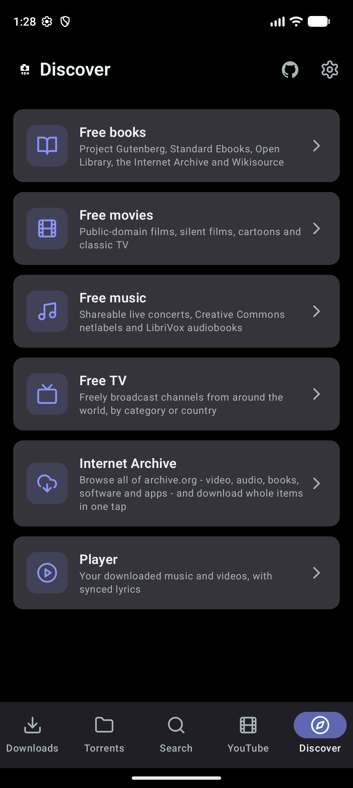
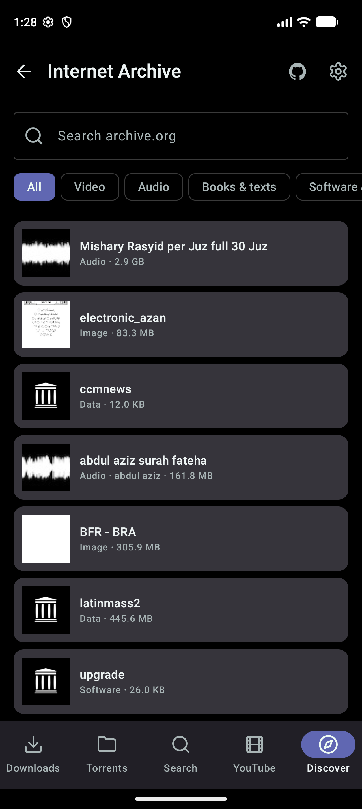
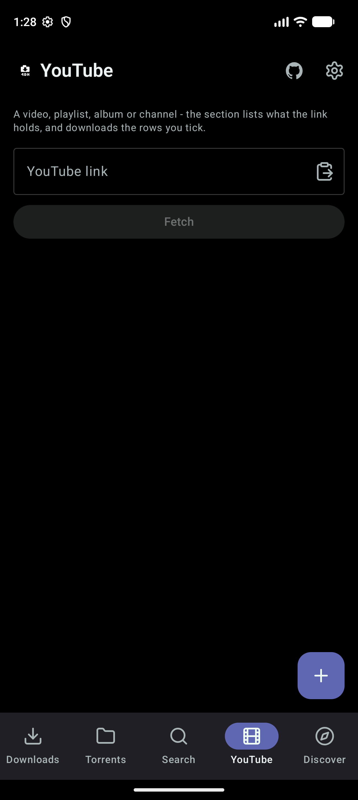

# 1 download manager

A free download manager for **Android** and **Windows**: direct links, YouTube, torrents and free
media libraries in one queue, with browser extensions for Chrome and Firefox.



<p>
  
  
  
  
</p>

## Features

- **Fast, resumable downloads** — segmented HTTP/HTTPS with pause, resume, retry and a speed limit.
- **Batch download** — paste many links at once, or a range like `file[001-120].jpg`.
- **YouTube** — videos, whole playlists, albums and channels; pick the quality or save audio as M4A, MP3, Opus or WAV.
- **Torrents** — magnet links and `.torrent` files, with file selection.
- **Internet Archive** — browse all of archive.org (video, audio, books, software, apps) and download a whole item in one click.
- **Free books, movies, music and TV** — public-domain and freely licensed sources, plus a built-in player.
- **Browser integration** — Chrome and Firefox extensions hand downloads to the app.
- **Automatic updates** — the app checks GitHub and installs new versions for you.
- **Themes** — light, dark and AMOLED, with nine colour palettes.

## Install

Get the latest version from the [releases page](https://github.com/RDK456/1-download-manager/releases/latest):

| Platform | File |
|---|---|
| Android | `1-download-manager-<version>.apk` (or the `arm64-v8a` / `x86_64` build for a smaller download) |
| Windows | `1-download-manager-<version>.msi`, or the `-portable.zip` to run without installing |
| Chrome / Edge | `1-download-manager-extension-chrome-<version>.zip` |
| Firefox | `1-download-manager-extension-firefox-<version>.xpi` |

The Windows installer needs no administrator rights. For a silent install:
`msiexec /i 1-download-manager-<version>.msi /qn`

## Build from source

Requirements: JDK 17 and the Android SDK (platform 35, build tools 35.0.0). Set `ANDROID_HOME`
or `sdk.dir` in `local.properties`, then:

```text
gradlew test                  # all unit tests
gradlew :app:assembleDebug    # Android APK
gradlew :desktop:run          # run the Windows app
```

The project has three modules: `core` (shared download, torrent and search engines in plain Kotlin),
`app` (Android, Jetpack Compose) and `desktop` (Windows, Compose Multiplatform).
More detail on the build machine setup is in [docs/BUILD-ENVIRONMENT.md](docs/BUILD-ENVIRONMENT.md).

## Releasing

`scripts/release.ps1` bumps the version, runs the tests and lint, builds every asset, commits,
tags, pushes and publishes the GitHub release:

```powershell
.\scripts\release.ps1                          # patch: 2.0.0 -> 2.0.1
.\scripts\release.ps1 -Bump Minor -NotesFile notes.md
```

Release builds are signed with `keystore/` (not in git). **Back up the keystore and its
passwords** — Android only updates an app signed with the same key.

## Legal

Only download content you own or have permission to download. See
[LICENSE-NOTICE.md](LICENSE-NOTICE.md) for third-party licences.
